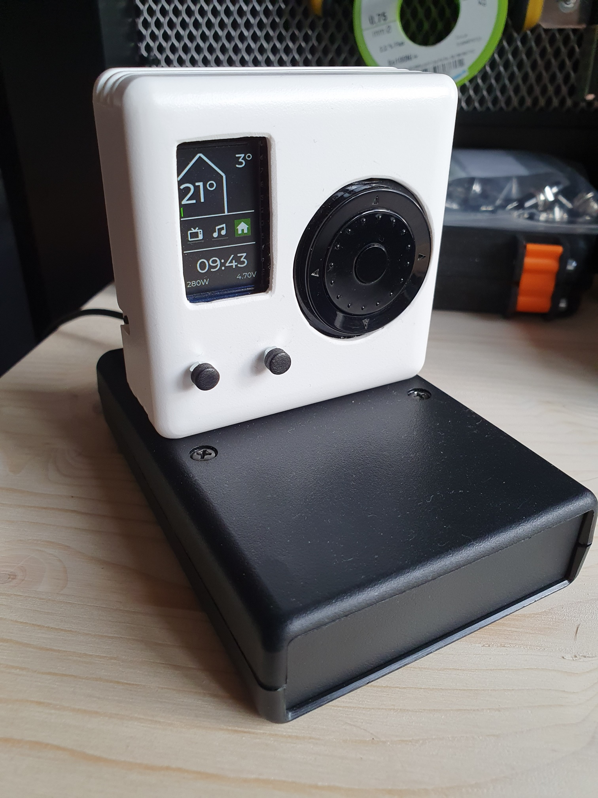

# homecontrol
A small universal remote for our smarthome, built around a Lilygo TTGO and a clickwheel, heavily inspired by homething.io

This repo is more a draft of notes at this time, so don't expect too much. Also: I'm not a software engineer, so lower your expectations when it comes to code quality.

Hardware:
- Lilygo TTGO v1.1 board, esp32, 240x135 pixel display
- adafruit clickwheel (plus breakout board!)
- 900mAh LiPo battery (the charging circuit on the TTGO is hardwired to 500mA as the charging current, using a battery below 800mAh capacity supposedly kills the battery fast, see https://www.youtube.com/watch?v=JIh8Z7XtVGw for details)
- off-the-shelf housing with cutouts where needed
- magnetic pogo pins to dock the remote to a charging dock
- reed relais to detect the docking status
- hand-soldered pcb with a lot of signs of my struggle to get lead-free solder to fully work for me
- USB C plug breakout board (as the only way to run the TTGO via external power and charge the battery at the same time is via the USB plug)

The overall inspiration to combine the TTGO with the clickwheel comes from https://github.com/landonr/homeThing (check it out, awesome project!)

Software:
- esphome
- lvgl
- material design icons via ttf font

Motivation:

I find it increasingly impractical to unlock my phone, open the Home Assistant app, and scroll to the right place on my dashboard to trigger something around the house, or to check the outside temperature etc. At the same time I don't want to have a stationary tablet on a wall somewhere. What I want is a small mobile device that provides infos and allows control "without fluff". Originally meant to be a small touchscreen, I started out with what I had laying around at home, which was the TTGO display board. I might later still create a touch-based version (without the clickwheel, but still with physical buttons), but that's for another time. 

The needs I want to cover:
- provide easy access to the most used controls and infos around our HomeAssistant-covered household
- mobile aka battery-driven, without the need for a constant cable connection or a plug to charge it
- physical buttons, so that I don't have to look on the screen for everything
- straightforward user interface

What I wanted to try out, because I just like tinkering:
- wrapping my head around LVGL within esphome and getting familiar with it
- including a magnetic dock connector, just because I find them a super smooth way of connecting things
- make the docking status of the device part of the usability, in a bulletproof way that doesn't rely on battery charge status monitoring

